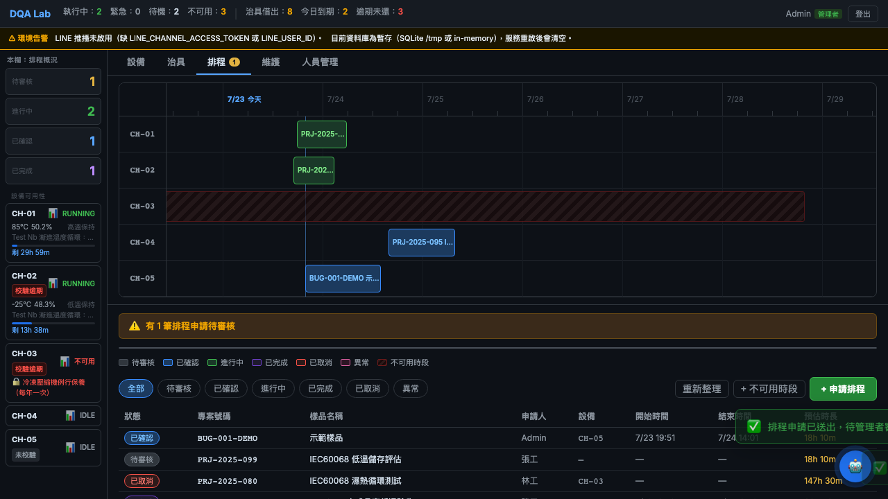
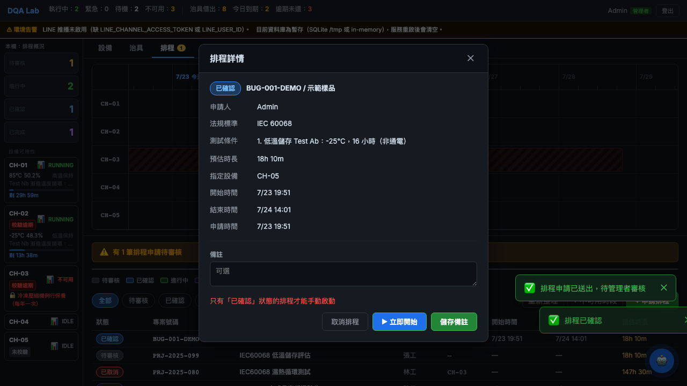
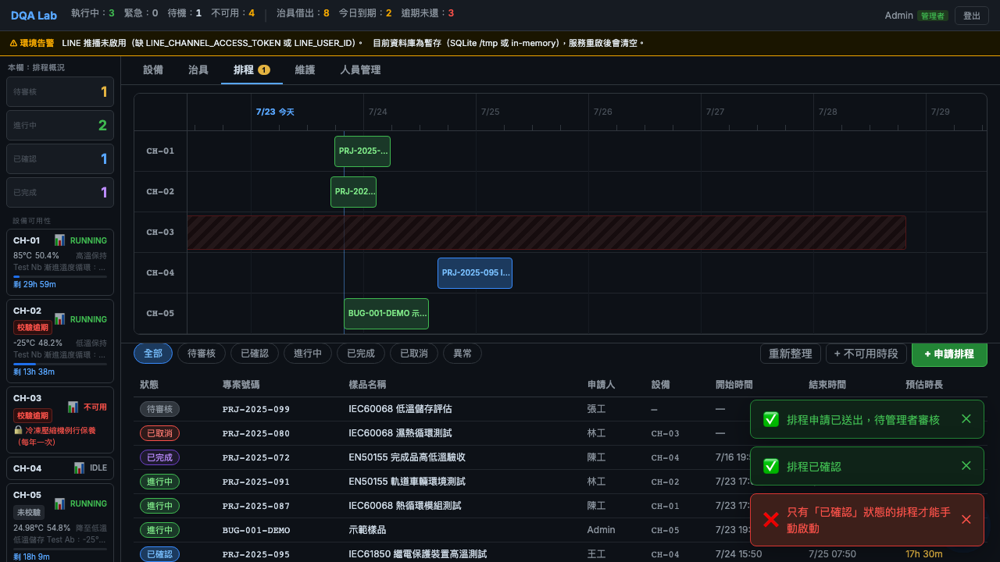

# BUG-001 — Confirmed schedule keeps showing "已確認", then a contradictory error on manual start

| Field | Value |
|-------|-------|
| **Bug ID** | BUG-001 |
| **Status** | Fixed (verified by regression test) |
| **Severity** | Medium |
| **Priority** | Medium |
| **Component** | Scheduling — confirmation & manual start (`SchedulePage`, `ScheduleDetailModal`) |
| **Environment** | DQA Lab Platform (local/demo), Chromium, React frontend + FastAPI backend |
| **Found by** | Automated E2E (Playwright), 2026-07-20 |
| **Reporter** | Sheng-Sheng Tsai |
| **Fix commit** | `8a115b3c5083fa12849c9f6adca4a65a28857ef9` |

## Summary

After an admin confirms a pending schedule, the schedule row in the list keeps
showing **已確認 (Confirmed)** and never updates on its own. The backend, however,
starts the assigned device and moves the schedule to **進行中 (Running)** within
~100 ms. If the admin then clicks **▶ 立即開始 (Start Now)** — trusting what the
screen shows — the app returns the red error
**"只有『已確認』狀態的排程才能手動啟動" (Only schedules in the 'Confirmed' state can be started manually).**

The screen says the schedule *is* 已確認, but the error says it is *not*. The user
has no way to make sense of the contradiction.

## Preconditions

- Logged in as **admin**.
- At least one **待審核 (Pending)** schedule exists.
- At least one device is **IDLE** (so auto-start succeeds immediately on confirm).

## Steps to reproduce

1. Open the **排程 (Schedule)** tab.
2. Click a **待審核** schedule to open its detail, then click **確認排程 (Confirm)**.
3. Confirmation succeeds and a device is auto-assigned.
4. **Do not refresh.** Look at the schedule's row in the list.
5. Click **▶ 立即開始 (Start Now)** on that row.

## Expected result

- After confirmation the row should reflect the real status. Because the backend
  moves the schedule to **進行中** almost immediately, the row should show
  **進行中** shortly after confirming — without a manual refresh.
- Any error shown on **立即開始** must be consistent with the status displayed on
  screen.

## Actual result

- The row keeps showing **已確認** and does not change until the user manually
  clicks **重新整理 (Refresh)**.
- Because the backend already moved the schedule to **進行中**, clicking
  **立即開始** returns: **"只有『已確認』狀態的排程才能手動啟動".**
- Net effect: the screen shows 已確認, the error insists it is not 已確認 —
  a self-contradiction.

## Evidence

**1. Immediately after confirmation — the row still shows 已確認 (no manual refresh yet):**

**2. Re-opening the schedule, ▶ 立即開始 is offered (status badge and row both read 已確認), but clicking it returns "只有「已確認」狀態的排程才能手動啟動". The screen says 已確認; the error says it is not:**

**3. After a manual 重新整理, the row finally flips to 進行中:**

## Root cause (analysis)

On confirm, the backend transitions the schedule to **進行中** almost immediately
(device auto-start). The frontend schedule list is **not refreshed** after this
transition, so it keeps rendering the stale **已確認** status until a manual
refresh. The manual-start guard is evaluated against the *real* backend state
(already Running) rather than the stale UI, which is why the rejection message
directly contradicts what the screen shows.

## Impact

- Misleads the user into an action (**立即開始**) that always fails with a
  confusing message; undermines trust in the displayed status.
- No data integrity risk: the server-side guard behaves correctly; only the UI is
  out of sync.

## Workaround

Click **重新整理 (Refresh)** after confirming. The row then shows **進行中** and
**立即開始** is no longer needed.

## Suggested fix

After a successful confirmation, reconcile the row with the server once the
near-immediate start has settled (re-fetch after the transition, or briefly poll
until the row stabilizes) so the UI shows **進行中** without a manual refresh.
Alternatively, hide/disable **立即開始** for any row whose backend state is
already **進行中**.

## Resolution

- **Fixed.** By the time the confirm request returns, the backend has already
  transitioned the schedule to **進行中** (it awaits the device start), so the
  frontend simply re-fetches the schedule list once on a successful confirm.
  The row now shows **進行中** on its own, no manual refresh. Change:
  `ScheduleDetailModal.confirm()` now calls `onRefresh()`.
- **Regression test.** `schedule-flow.spec.js` no longer clicks **重新整理**; it
  asserts the row turns **進行中** by itself after confirmation. The test fails if
  the auto-refresh is ever removed.

## Notes

- Discovered while building the Playwright E2E suite.
- Written against the live bug (evidence above) **before** fixing, then fixed and
  verified — documenting the full find → report → fix → verify cycle.
