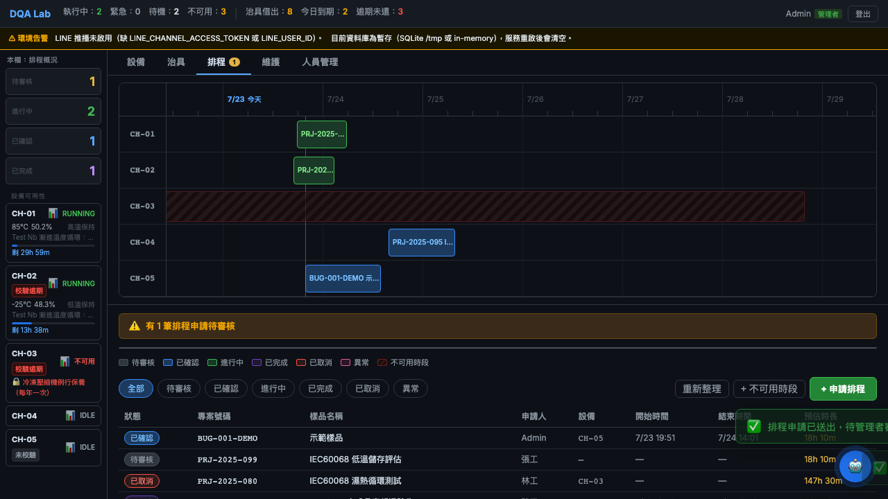
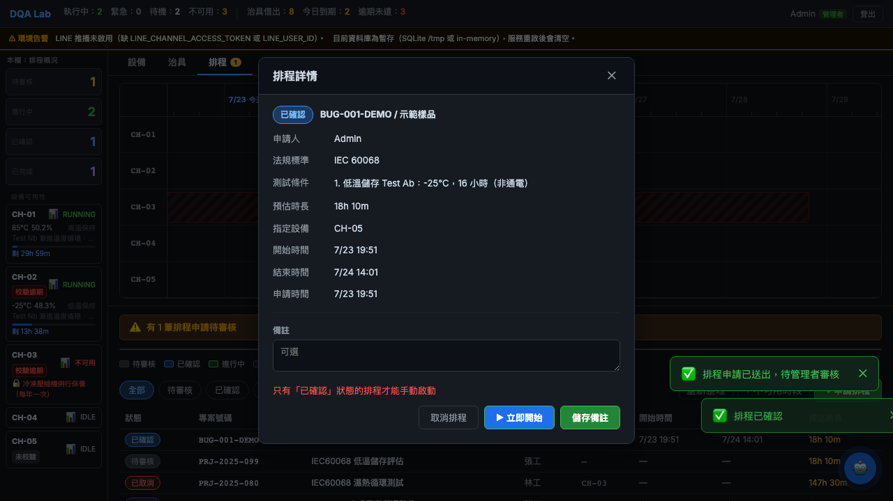
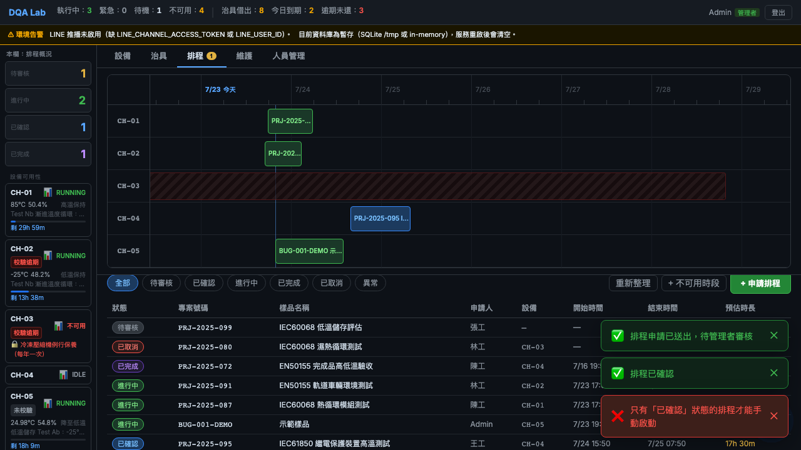

# BUG-001 — 排程確認後畫面仍顯示「已確認」，手動啟動卻回報互相矛盾的錯誤

[English](BUG-001-schedule-status-not-refreshed-after-confirm.md) · 繁體中文

| 項目 | 內容 |
|-------|-------|
| **缺陷編號** | BUG-001 |
| **狀態** | 已修正（有回歸測試驗證） |
| **嚴重度** | Medium |
| **優先度** | Medium |
| **元件** | 排程 — 確認與手動啟動（`SchedulePage`、`ScheduleDetailModal`） |
| **環境** | DQA Lab Platform（本機／Demo）、Chromium、React 前端 + FastAPI 後端 |
| **發現方式** | 自動化 E2E（Playwright），2026-07-20 |
| **回報者** | 蔡聖生 |
| **修正 commit** | `8a115b3c5083fa12849c9f6adca4a65a28857ef9` |

## 摘要

管理者確認一筆待審核排程之後，列表上那一列會一直顯示**已確認**，不會自己更新。
但後端其實在約 100 毫秒內就啟動了指派的設備，並把排程改成**進行中**。此時管理者
若相信畫面顯示的內容、去按**▶ 立即開始**，系統會回一個紅色錯誤：
**「只有『已確認』狀態的排程才能手動啟動」**。

畫面說這筆**是**已確認，錯誤訊息卻說它**不是**。使用者無從理解這個矛盾。

## 前置條件

- 以 **admin** 身分登入。
- 至少有一筆**待審核**排程。
- 至少有一台設備是 **IDLE**（這樣確認時才會立刻自動啟動）。

## 重現步驟

1. 開啟**排程**分頁。
2. 點一筆**待審核**排程打開明細，然後按**確認排程**。
3. 確認成功，系統自動指派設備。
4. **不要重新整理。** 看列表上那一列的狀態。
5. 在那一列按**▶ 立即開始**。

## 預期結果

- 確認之後，該列應該反映真實狀態。由於後端幾乎立刻把排程改成**進行中**，該列
  應該在確認後不久就顯示**進行中**，而且不需要人工重新整理。
- **立即開始**若出現任何錯誤，內容必須與畫面上顯示的狀態一致。

## 實際結果

- 該列一直顯示**已確認**，直到使用者手動按下**重新整理**才會變。
- 因為後端早就把排程改成**進行中**，按下**立即開始**會得到：
  **「只有『已確認』狀態的排程才能手動啟動」**。
- 淨結果是：畫面顯示已確認，錯誤訊息卻堅持它不是已確認——自相矛盾。

## 證據

**1. 確認後立刻查看——該列仍顯示已確認（尚未人工重新整理）：**

**2. 重新打開該排程，▶ 立即開始 仍可點選（狀態標籤與列上都寫已確認），但按下去得到「只有『已確認』狀態的排程才能手動啟動」。畫面說已確認，錯誤說不是：**

**3. 人工重新整理後，該列才終於變成進行中：**

## 根因（分析）

確認時，後端幾乎立刻把排程轉成**進行中**（設備自動啟動）。前端的排程列表在這個
轉換之後**沒有重新抓資料**，所以在人工重新整理之前，它會一直渲染過期的**已確認**
狀態。手動啟動的守衛是拿**真實的**後端狀態（已經是進行中）去判斷，而不是過期的
UI，這就是為什麼拒絕訊息會直接牴觸畫面顯示的內容。

## 影響

- 誤導使用者去做一個註定失敗的操作（**立即開始**），還附上一個令人困惑的訊息；
  傷害使用者對畫面狀態的信任。
- 沒有資料完整性風險：伺服器端的守衛行為正確，只有 UI 不同步。

## 暫時處置

確認後按一下**重新整理**。該列就會顯示**進行中**，也不再需要**立即開始**。

## 建議修法

確認成功之後，等那個「幾乎立刻發生」的啟動塵埃落定，再讓該列與伺服器對齊
（轉換後重新抓一次，或短暫輪詢到該列穩定），讓 UI 不需人工重新整理就顯示
**進行中**。或者，對任何後端狀態已是**進行中**的列，隱藏／停用**立即開始**。

## 解法

- **已修正。** 確認請求回來的當下，後端其實已經把排程轉成**進行中**了（它會等
  設備啟動完成），所以前端只要在確認成功時重新抓一次排程列表即可。該列現在會
  自己顯示**進行中**，不必人工重新整理。最初的修法是透過 `onRefresh()` 重抓列表；
  目前的實作改呼叫必要的 `onMutation()` callback，它會同時刷新排程列表與全域的
  排程／治具摘要。
- **回歸測試。** `schedule-flow.spec.js` 不再按**重新整理**，而是斷言該列在確認後
  會自己變成**進行中**。若自動重抓被拿掉，這個測試就會失敗。

## 備註

- 在建置 Playwright E2E 套件的過程中發現。
- 截圖記錄的是仍受影響的版本；公開 Git 歷史中修正 commit 早於報告 commit，因此
  本案例不宣稱報告本身是在修正前完成。
