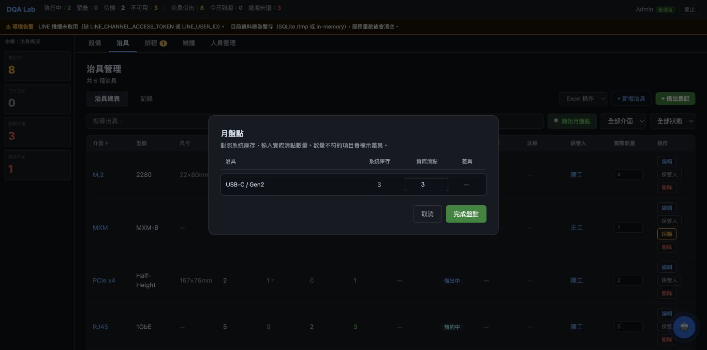

# BUG-014 — Monthly stocktake silently omitted off-site fixtures and still reported the partial count as complete

English · [繁體中文](BUG-014-monthly-stocktake-silently-omitted-fixtures.zh-TW.md)

| Field | Value |
|---|---|
| **Bug ID** | BUG-014 |
| **Status** | Fixed |
| **Severity** | Medium |
| **Priority** | Medium |
| **Component** | Fixture monthly-stocktake scope and completion result (`StocktakeModal.jsx`) |
| **Environment** | Admin fixture page; any deployment with loaned or reserved fixtures |
| **Found by** | Codex whole-project UX review, 2026-08-19 |
| **Reporter** | Sheng-Sheng Tsai |
| **Fix commit** | `f496d13969ba73bca6f631eb93578dc7653a0fa0` |
| **Report timing** | Written after the fix; the pre-fix screen was recreated on 2026-08-24 in an isolated checkout of `4b566f46f616b9ce67dae885fcdb802e176e72c9` |

## Summary

The monthly stocktake listed only fixture types whose full quantity could be counted on site. If any unit of a
fixture type was loaned or reserved, the entire type was filtered out of `active`. The screen did not name the
omitted fixtures or say how much of the catalogue the list covered.

Submission used that same `active` list to calculate the “normal/difference” success result. An operator could
therefore count only a small subset and still receive “stocktake complete”. If every type was excluded, the empty
dialog still allowed submission and reported zero normal and zero differences. The omitted stock was not
overwritten, but “not counted” was presented as “no difference”.

## Preconditions

- At least one fixture type has a loaned or schedule-reserved unit.
- An administrator can open the fixture table and monthly stocktake.

## Steps to reproduce on the pre-fix revision

1. Start pre-fix commit `4b566f46f616b9ce67dae885fcdb802e176e72c9` with the demo seed.
2. Sign in as an administrator and open Fixture Management.
3. Confirm that the table contains six fixture types, several loaned or reserved.
4. Select “Start monthly stocktake”.
5. Compare the catalogue count with the fixture types listed in the dialog.

To exercise the empty-list branch, give every fixture type at least one loaned or reserved unit, reopen the dialog,
and select “Complete stocktake”.

## Expected result

- Types that cannot be counted fully on site remain visible in the scope summary and state why they are excluded.
- Counted types plus excluded types always equals the complete fixture catalogue.
- When no type can be counted, completion is disabled and cannot produce a success result.

## Actual result

- Of six fixture types, the dialog listed only the countable `USB-C / Gen2`; the other five disappeared silently.
- The introductory copy implied that the visible row was the complete stocktake scope.
- The completion button was disabled only while a request was in flight, not when the list was empty.
- The success message counted only the surviving rows and disclosed no excluded total.

## Evidence



The screenshot was not captured contemporaneously with the fix. It was recreated afterwards by running the
pre-fix commit above against an isolated demo database. The fixture page behind the dialog says there are six
fixture types; the stocktake dialog contains only `USB-C / Gen2`.

Before the fix, `StocktakeModal.jsx` built `active` from fixture status, rendered only `active`, and used only
`active` for requests and the completion message. There was no complementary `excluded` set, total reconciliation,
or empty-list guard.

## Root cause

One array represented two different concepts:

1. whether the full quantity of a fixture type can be counted on site now; and
2. whether that fixture type belongs to the scope of this stocktake.

A loaned or reserved type should not accept a full on-site count, but it does not cease to belong to the stocktake.
Because `active` controlled rendering, API writes, and the success summary, filtered data also lost its “not
counted” identity. No invariant required `counted + excluded = total`, so an incomplete list produced no observable
failure.

## Impact

- An administrator could mistake a partial count for a completed monthly stocktake and gain false confidence in
  inventory completeness.
- The fixtures most likely to disappear were the ones moving outside the lab — the types whose whereabouts most
  need to be explicit.
- No omitted quantity was written incorrectly, so severity is Medium rather than High; the defect falsified scope
  and result semantics rather than stored stock.
- The defect occurred whenever any fixture was loaned or reserved; no race or API failure was required.

## Resolution

[`StocktakeModal.jsx`](../../client/src/components/fixture/StocktakeModal.jsx) now partitions fixtures into
complementary `active` and `excluded` sets:

- Countable types keep the existing actual-quantity inputs.
- Excluded types list their fixture identity, system stock, loaned count, and reserved count, with an explanation
  that their full quantity cannot be verified on site.
- The footer reports “N types covered, M types excluded”.
- When `active.length === 0`, the dialog shows an explicit empty state and disables completion.

The resolution does not pretend to count off-site fixtures and does not write them back to stock. It makes the
boundary of the operation visible and reconcilable.

## Verification

```bash
make test-e2e ARGS="specs/stocktake-scope.spec.js"
```

[`stocktake-scope.spec.js`](../../tests/e2e/specs/stocktake-scope.spec.js) first reads the total fixture-type count
from the page, opens monthly stocktake, requires an excluded section, and asserts:

```
covered types + excluded types = total fixture types
```

It also requires at least one excluded type in the demo seed, avoiding a vacuous all-zero pass.

The E2E does not separately seed the “every type is off site” case to click-check the disabled button. That branch
is protected by `disabled={loading || active.length === 0}` in the component; it remains a residual test gap if
stocktake rules change again.
