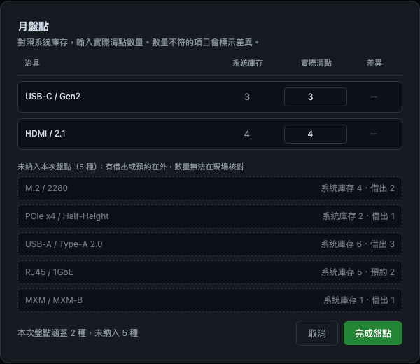
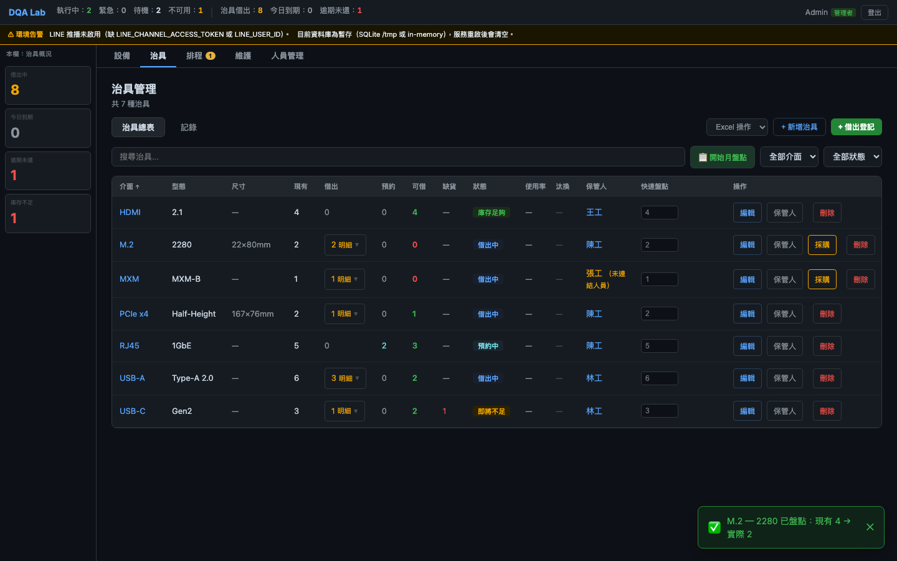

# BUG-014 — 月盤點靜默漏掉在外治具，仍把部分清點回報成完成

[English](BUG-014-monthly-stocktake-silently-omitted-fixtures.md) · 繁體中文

| 欄位 | 內容 |
|---|---|
| **缺陷編號** | BUG-014 |
| **狀態** | 已修正 |
| **嚴重度** | Medium |
| **優先度** | Medium |
| **元件** | 治具月盤點範圍與完成結果（`StocktakeModal.jsx`） |
| **環境** | 管理者治具頁；任何有借出或預約中治具的部署 |
| **發現方式** | Codex 全專案 UX 審查，2026-08-19 |
| **回報者** | 蔡聖生 |
| **修正 commit** | `f496d13969ba73bca6f631eb93578dc7653a0fa0` |
| **報告時序** | 修正後整理；修正前畫面於 2026-08-24 從 pre-fix commit `4b566f46f616b9ce67dae885fcdb802e176e72c9` 的隔離環境重新產生 |

## 摘要

月盤點只把「現場能數到完整數量」的治具放進清單。只要某種治具有借出或預約，整個品項就被
`active` 篩選排除；畫面沒有說哪些項目消失，也沒有顯示清單涵蓋多少種治具。

送出結果也使用同一份 `active` 清單計算「正常／差異」。因此使用者即使只盤到全部治具的一小部分，
仍會收到「盤點完成」；若所有品項都被排除，空白視窗的「完成盤點」仍可按，並回報
「正常 0、差異 0」。系統沒有竄改被排除品項的數量，但把「沒有盤到」呈現成「沒有差異」。

## 前置條件

- 系統內至少有一種治具正被借出或被排程預約。
- 管理者可以進入治具總表並開啟月盤點。

## 在修正前的版本上重現

1. 啟動 pre-fix commit `4b566f46f616b9ce67dae885fcdb802e176e72c9`，建立 demo 資料。
2. 以管理者登入，進入「治具」。
3. 確認治具總表顯示共有 6 種治具，其中多種處於借出或預約狀態。
4. 按下「開始月盤點」。
5. 比較總表的治具種類與盤點視窗列出的種類。

若要重現空清單的分支，讓每一種治具都至少有一件借出或預約，再開啟月盤點並按下
「完成盤點」。

## 預期結果

- 不能現場完整清點的品項仍要出現在盤點範圍說明裡，並標示未納入及原因。
- 「本次涵蓋數 + 未納入數」必須等於治具總數。
- 沒有任何可盤項目時，完成按鈕應停用，不能產生成功語意。

## 實際結果

- 6 種治具中，視窗只列出 `USB-C / Gen2`，其餘 5 種沒有任何說明。（原本寫它是唯一可現場完整清點的品項，這句是錯的，見文末「後續更正」。）
- 畫面只有「對照系統庫存」的說明，讓這一列看起來就是全部盤點範圍。
- 完成按鈕只在 request 送出期間停用；清單為空時仍可送出。
- 成功訊息只計算留下來的品項，沒有揭露被排除數量。

## 證據


這張圖不是修正當時同步拍攝，而是在修正後切回上述 pre-fix commit、使用隔離 demo 資料庫重現。
背景治具頁顯示「共 6 種治具」，月盤點視窗只有 `USB-C / Gen2` 一列。

修正前的 `StocktakeModal.jsx` 先依狀態建立 `active`，之後只 render `active`，送出與成功訊息也只讀
`active`；沒有 `excluded`、總數對帳或空清單守衛。

## 根本原因

程式把兩個不同概念合成同一份陣列：

1. **這個品項現在能不能在現場數到完整數量**；
2. **這個品項是不是本次盤點範圍的一部分**。

借出或預約中的品項確實不適合輸入完整實際數量，但不代表它可以從範圍中消失。`active` 同時控制
畫面、API request 與成功摘要後，被篩掉的資料連「未盤」的身分也失去了；程式又沒有維持
`涵蓋 + 未納入 = 全部` 的不變式，所以清單少了東西也不會留下可觀察訊號。

## 影響

- 管理者可能把部分盤點誤認為整批盤點，對庫存完整性得到錯誤信心。
- 最容易被漏掉的正是在實驗室外流動的治具；它們也是最需要交代去向的品項。
- 被排除的庫存沒有被寫成錯誤數字，因此嚴重度不是 High；問題在於操作結果與涵蓋範圍失真。
- 只要存在借出或預約中的品項就會發生，不需要競態或 API 失敗。

## 修法

[`StocktakeModal.jsx`](../../client/src/components/fixture/StocktakeModal.jsx) 現在把治具分成互補的
`active` 與 `excluded`：

- 可盤點品項維持原本的實際數量輸入。
- 未納入品項逐列顯示治具、系統庫存、借出數與預約數，並說明現場無法核對完整數量。
- 視窗底部顯示「本次盤點涵蓋 N 種，未納入 M 種」。
- `active.length === 0` 時顯示空狀態並停用「完成盤點」。

這個修法沒有假裝能盤點在外治具，也沒有把它們寫回庫存；它只讓盤點的邊界可見且可核對。

## 驗證

```bash
make test-e2e ARGS="specs/stocktake-scope.spec.js"
```

[`stocktake-scope.spec.js`](../../tests/e2e/specs/stocktake-scope.spec.js) 先從治具頁讀取總種類數，
再打開月盤點，確認存在「未納入本次盤點」區塊，並斷言：

```
本次涵蓋數 + 未納入數 = 治具總數
```

這會抓到任何再次被靜默吃掉的品項。測試也要求 demo 資料至少有一種未納入，避免等式只在
`0` 的退化情境下通過。

目前 E2E 沒有另外建出「全部品項皆在外」來點驗停用按鈕；該分支由元件條件
`disabled={loading || active.length === 0}` 保護。若盤點規則未來再改，這是應補的殘餘測試缺口。

## 後續更正（2026-09-17）

**時序**：問題是 2026-09-17 全專案架構重掃時發現的，這一段與修正同時寫。修正前的畫面是在修之前，用隔離的 demo 資料庫實際拍下的。

原報告說 `USB-C / Gen2` 是唯一能現場完整清點的品項，這句是錯的：修正前的種子資料裡，它有一件逾期借出。
它會被列進清單，是因為判斷用的是治具徽章上的那一個字。徽章只能顯示一個狀態，優先順序是「缺貨 > 即將不足 >
借出中 > 預約中」；USB-C 被手動標了缺 1 件，徽章寫「即將不足」，借出那件就被蓋掉了。上面的修法沿用同一個判斷，
所以這個誤判一直留著，而那支 E2E 只驗「涵蓋數 + 未納入數 = 總數」，分錯邊照樣會過。

這次跟原缺陷不同的地方是**會寫錯庫存**：照架上數到的數量送出，總數會被改小，借出的那件歸還後也回不來。
同一個後果有三個入口：

| 入口 | 修正前 |
|---|---|
| 月盤點視窗 | 「即將不足」又有借出或預約的治具被列為可盤 |
| 治具列上的快速盤點 | 不看有沒有東西在外，任何治具都能直接送出 |
| 盤點紀錄批次編輯的「新增一筆」 | 同上 |

「借出中」篩選也拿徽章那個字判斷，所以同樣看不到 USB-C。

重現時種子資料多加了一支沒有任何借出或預約的 `HDMI / 2.1`，當作「真的可以盤」的對照；修正後 demo
打開月盤點也還有品項可以盤。





**修法**（與本段更正在同一個 commit）：

- [`fixtureStatus.js`](../../client/src/utils/fixtureStatus.js) 把「徽章顯示哪個字」「能不能現場盤」「借出中篩選」拆成三個各自明說的判斷，
  月盤點、快速盤點、批次新增與篩選共用。
- 後端 `record_inventory_count`（兩個盤點 API 共用）在有借出或預約在外時回 409，並說明確定要改總數請用「編輯」。
  修改既有盤點紀錄那條路刻意不擋：它是把被這個缺陷改小的總數修回來的管道。

**驗證**：

```bash
cd backend && ../venv/bin/python -m pytest tests/test_fixtures_api.py
cd client && npm test
make test-e2e ARGS="specs/stocktake-scope.spec.js"
```

- `test_fixtures_api.py` 對兩個盤點 API、借出與預約兩種狀態，都斷言回 409 且總數不變；借用都已歸還時照常可盤。
- `fixtureStatus.test.js` 釘住「徽章寫即將不足、但有借出」不可盤，而且會出現在「借出中」篩選。
- `stocktake-scope.spec.js` 新增三條：月盤點的分邊、快速盤點那格寫出原因、批次新增的選單停用。
